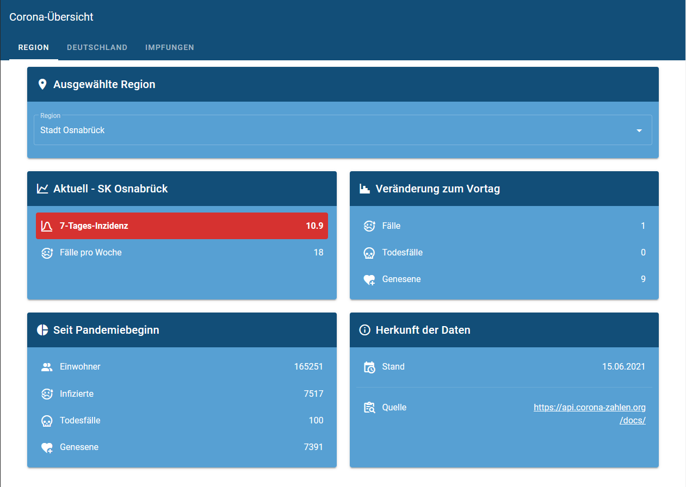

# Simple-Corona-Tracker

Ein kleines Vue-Projekt zur Übersicht über

#### Den aktuellen Coronastatus in einer Region (z.B. Stadt und Landkreis)
  

#### Den aktuellen Coronastatus in Deutschland
  
#### Den aktuellen Impfstatus in Deutschland und Niedersachsen

  
Da die Daten nur täglich aktualisiert werden, werden die Anfrageergebnisse 24 Stunden gecached, sodass die API weniger belastet wird.
Falls ihr das Projekt selber verwenden wollt, beachtet bitte die Hinweise der API (https://api.corona-zahlen.org/docs/) und hostet die API ggf. selber.

## Herkunft der Daten

Dieses Projekt verwendet

- die Robert Koch-Institut API (v2): https://api.corona-zahlen.org/docs/
- Github: https://github.com/marlon360/rki-covid-api

## Projektsetup

Umbennen der `config.edit.js` Datei in `config.js`.

Hinzufügen über eine Zeile: ` {name: "Stadt Osnabrück", code: "03404"}`
Der Code einer Region kann hier gefunden werden: https://api.corona-zahlen.org/districts 

Danach kann das Projekt gestartet werden:
```
npm install
npm run serve
```
